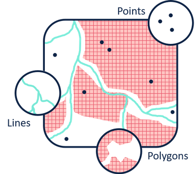

```{r setup, include=FALSE}
options(htmltools.dir.version = FALSE)
knitr::opts_chunk$set(
  echo = FALSE,
  fig.align = "center",
  message = FALSE,
  warning = FALSE
)
mapview::mapviewOptions(leafletWidth = 400, leafletHeight = 400)
```

```{r xaringan-themer, include=FALSE, warning=FALSE}
library(xaringanthemer)
extra_css <- list(
  ".title-slide h1" = list("color" = "#413c69", "font-size" = "4rem"),
  ".title-slide h2" = list("color" = "#c94281"),
  ".inverse h3" = list("color" = "#1687a7"),
  ".inverse h1" = list("color" = "#1687a7"),
  ".purple_h1" = list(
    "font-family" = "var(--header-font-family)",
    "color" = "#944db3",
    "font-size" = "1rem"
  ),
  ".black_color" = list("color" = "#413c69"),
  ".pull-center" = list(
    "position" = "absolute",
    "top" = "10%",
    "color" = "#ff499e",
    "font-size" = "45px",
    "transform" = "rotate(-45deg)",
    "font-weight" = "bold"
  ),
  ".pull-top" = list(
    "position" = "absolute",
    "top" = "25%",
    "color" = "#af96d9"
  ),
  ".right-column2" = list(
    "width" = "55%",
    "height" = "92%",
    "float" = "right"
  ),
    ".left-column2" = list(
    "width" = "40%",
    "height" = "92%",
    "float" = "left"
  ),
  ".col-left" = list(
    "width" = "55%",
    "height" = "92%",
    "float" = "left"
  ),
  ".col-right" = list(
    "width" = "40%",
    "height" = "92%",
    "float" = "right"
  )
)
style_duo_accent(
  primary_color = "#b5f7de",
  secondary_color = "#FFFFFF", 
  white_color = "#dad9fc",
  inverse_header_color = "#944db3",
  text_bold_color = "#ff499e",
  link_color = "#bf4392",
  header_h1_font_size = "3rem",
  header_h2_font_size = "1.5rem", 
  header_color = "#944db3",
  title_slide_text_color = "#413c69",
  code_inline_color = "#d008bf", 
  text_slide_number_color = "#7c807f",
  header_font_google = google_font("Play", "400"),
  text_font_google   = google_font("Titillium Web", "400"),
  code_font_google   = google_font("IBM Plex Mono"),
  extra_css = extra_css
)
```

class: middle
background-image: url("img/cohete.png")
background-size: 400px 400px
background-position: center right

# ¿De qué hablaremos hoy?

--

- Diferentes tipos de datos espaciales

--
- Paquetes para trabajar con datos espaciales en R

--
- Gramática de los gráficos

--
- Ejemplo práctico con `{ggplot2}`

--
- Ejemplo práctico con `{mapview}`

---
class: inverse
# Diferentes tipos de datos espaciales

.pull-left[
.h2[VECTORES]
.p-caption[
```{r, out.width="55%", fig.cap="Fuente: <a href='http://katiejolly.io/rnorth-19'> @Katie Jolly </a>"}

```
]
]

.pull-right[
```{r, out.width="40%"}
knitr::include_graphics("img/vectorcat.png")
```

- Mediciones de campo
- Estaciones meteorológicas
- Caminos
- Rutas GPS
- Comunas
- Regiones
- Áreas de estudio

.purple_h1[FORMATOS MÁS UTILIZADOS:

ESRI Shapefile (.shp), GeoJSON(.geojson), Keyhole Markup Language (.KML), ...] 
]


---
class: inverse

# Diferentes tipos de datos espaciales

.pull-left[
.h2[RÁSTER]
.p-caption[
```{r, out.width="62%", fig.cap="Fuente: <a href='http://katiejolly.io/rnorth-19'> @Katie Jolly </a>"}
knitr::include_graphics("img/raster.png")
```
]
]

.pull-right[
```{r, out.width="40%"}
knitr::include_graphics("img/pixelcat.png")
```

- Imágenes satelitales
- Modelos climáticos
- Interpolaciones espaciales
- Imágenes aéreas
- Modelos de elevación digital
- Usos de suelo
- Datos (numéricos o categóricos) en grillas regulares


.purple_h1[FORMATOS MÁS UTILIZADOS:

GeoTiff(.tif), netCDF(.nc), ESRI Asci (.asc), ...] 
]

---
class: inverse
background-image: url("https://user-images.githubusercontent.com/520851/50280460-e35c1880-044c-11e9-9ed7-cc46754e49db.jpg")
background-position: bottom left
background-size: 600px 550px

# Vectores: paquete `{sf}`

.col-left[

]

--
- Es el paquete "más moderno" para trabajar con vectores.

--
- Actúa bajo la lógica de **simple features** en donde un objeto espacial se divide en dos componentes:

1.- data.frame (tabla de atributos)

2.- geometría **geometry** (información espacial adherida)

--
- Es compatible con **tidyverse**

---
class: inverse
background-image: url("img/cube1.png")
background-position: bottom left
background-size: 550px 450px
# Paquetes para trabajar con rásters

.col-left[

]

--

`{raster}`: más utilizado, más antiguo, más tutoriales

--

`{stars}`: hermano de sf, funciona con una lógica similar, es compatible con ggplot

--

`{terra}`: sucesor de ráster, más moderno, menos tutoriales.

--

 Otros: dependiendo de formatos más específicos

`{ncdf4}`

`{rhdf5}`

---
class: inverse
# Gramática de los gráficos

```{r, out.height="70%", out.width="85%", fig.align='center'}

```

